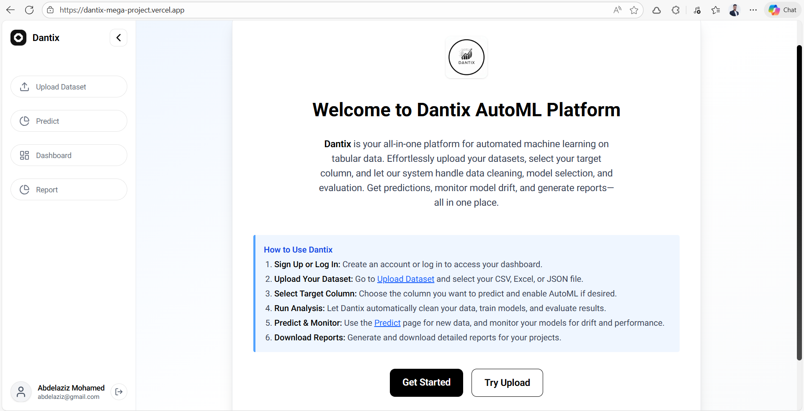

## Dantix AutoML Frontend - DEPI Mega Project

Modern React/Next.js frontend for the Dantix AutoML platform. It provides a secure dashboard where users can upload datasets, trigger automated model training, inspect model performance, run predictions, and explore dataset insights.



---

## Dantix - Live Demo

**Live Demo:** [https://dantix-mega-project.vercel.app/](https://dantix-mega-project.vercel.app/)

---

## Tech Stack

- **Framework**: Next.js (App Router)
- **Language**: React (JavaScript)
- **Styling**: Tailwind CSS, shadcn ui
- **HTTP Client**: Axios (with auth interceptor)
- **Charts**: Recharts

---

## Core Features

- **Authentication**

  - Login and registration screens integrated with `/api/Account/Login` and `/api/Account/Register`.
  - Central `AuthContext` with token and user persistence in `localStorage`.
  - `ProtectedRoute` wrapper to guard authenticated pages.

- **Dataset Upload**

  - Upload CSV/Excel/JSON datasets with a selected target column and optional AutoML flag.
  - Stores the last successful upload response (including dataset id) in a `dataset_response` cookie.

- **Prediction**

  - Loads dataset schema and available models from backend services.
  - Generates a dynamic feature form (numeric / categorical / boolean) from schema metadata.
  - Submits feature values to the prediction endpoint and displays the returned prediction payload.

- **Dashboard & Exploratory Analysis**

  - Fetches dashboard data per dataset and renders multiple visualizations (heatmaps, histograms, scatter plots, aggregated bars, box summaries) using Recharts and custom layouts.

- **Model Report**

  - Displays best model details, per-model metrics, and a comparison table.
  - Renders a markdown-style narrative report returned by the backend.

- **Responsive Layout & Navigation**
  - Desktop sidebar with navigation to Upload, Predict, Dashboard, and Report.
  - Mobile-friendly header with a slide-out menu mirroring sidebar navigation.

---

## Frontend Architecture

- **Global Layout** (`app/layout.jsx`)

  - Wraps the app in `AuthProvider`.
  - Renders a persistent sidebar on desktop and a scrollable main content area.

- **Auth Layer** (`components/shared/AuthContext.jsx`)

  - Exposes `login`, `register`, `logout`, `user`, and `isAuthenticated` through `useAuth()`.
  - Automatically reads and writes the bearer token (`auth_token`) to `localStorage`.
  - Integrates with a shared Axios instance that injects the `Authorization` header for all API calls.

- **HTTP & Services** (`lib/*`)

  - `lib/api.js`: Axios instance with base URL and auth interceptor.
  - `lib/authService.js`: Thin wrappers for login and registration endpoints.
  - `lib/datasetService.js`: Upload, dashboard, schema, model report, and prediction API helpers.
  - `lib/utils.js`: Utility helpers (class name merge, cookie helpers, etc.).

- **UI Components** (`components/ui/*`, `components/shared/*`)
  - Reusable primitives: `Button`, `Input`, `Label`, `Card`, `Alert`, `Form`, `Spinner`.
  - Layout/navigation: `Sidebar`, `Header`, `MobileMenu`, `ProtectedRoute`.

---

## Main Routes

- `/` – Landing page with a high-level overview and calls to action.
- `/auth/login` – Username/password login form.
- `/auth/register` – User registration form.
- `/upload` – Dataset upload flow (file + target column + AutoML flag).
- `/predict` – Schema- and model-aware prediction UI for single-row inference.
- `/dashboard` – Dataset-level charts and exploratory analysis.
- `/report` – Model comparison, best-model summary, and detailed markdown report.

All non-auth routes are protected by `ProtectedRoute` and require a valid login.

---

## Installation & Running

To run this project locally, follow these steps:

1. Clone the repository:

```bash
  git clone https://github.com/Abdelaziz-Mohammed/dantix-mega-project.git
```

2. Navigate to the project directory:

```bash
  cd dantix-mega-project
```

3. Install the dependencies:

```bash
  npm install
```

4. Start the development server:

```bash
  npm run dev
```

5. Open your browser and visit `http://localhost:3000` to view dantix frontend.

---

## Notes

- This frontend expects a running backend exposing the Dantix AutoML API (auth, dataset upload, schema, dashboard, models, and prediction endpoints).
- Authentication and all dataset-related requests are sent with a bearer token automatically added by the Axios interceptor.

---

## Frontend Team

- **Eng. Adham Ahmed**
- GitHub: [Adham Ahmed GitHub](https://github.com/AdhamAhmed2005)
- LinkedIn: [Adham Ahmed LinkedIn](https://www.linkedin.com/in/adham-altony)

- **Eng. Abdelaziz Mohamed**
- GitHub: [Abdelaziz Mohamed GitHub](https://github.com/Abdelaziz-Mohammed)
- LinkedIn: [Abdelaziz Mohamed LinkedIn](https://www.linkedin.com/in/abdelaziz)
