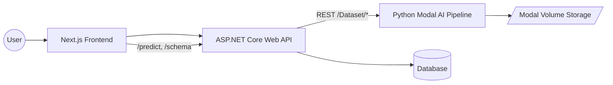

# Agentic AI System — Full Stack Documentation

A complete, production-ready **Agentic AI platform** combining:

- **Next.js Frontend**  
- **ASP.NET Core Backend**  
- **Python AI/ML Pipeline deployed on Modal**  
- **Database layer with ERD + Mapping**  

This README documents the entire system architecture and how each layer interacts.

---

## 🏗️ System Architecture Overview



---

## 1. Frontend (Next.js)

### Tech Stack
- Next.js 14  
- React  
- TailwindCSS  
- Axios  

### Routes
- `/auth/login`, `/auth/register`  
- `/upload`, `/predict`, `/dashboard`, `/report`

---

## 2. Backend (ASP.NET Core API)

Handles auth, dataset records, and bridges frontend ↔ AI pipeline.

### Key Endpoints
| Endpoint | Purpose |
|---------|---------|
| POST /Account/Login | Auth |
| POST /Dataset/upload | Upload dataset |
| GET /Dataset/dashboard/{id} | Dashboard data |
| GET /Dataset/models/{id} | AutoML results |
| POST /predict | Prediction |

---

## 3. Database Layer

### ERD (Simplified)

```
ApplicationUser
    ID (PK)
    UserName
    Email
    Password
    CreatedAt

DatasetRecord
    ID (PK)
    FileName
    FilePath
    UploadedAt
    UserId (FK)
    TargetColumn
    RunAutoML
```

---

## 4. AI System (Python + Modal)

The heart of the project, containing:

### Pipeline Stages
1. **Ingestion Agent**
2. **Preprocessing Agent**
3. **Feature Engineering Agent**
4. **Model Training Agent**
5. **Visualization Agent**
6. **Auto AI Agent (LLM‑Driven)**

### Models Supported
- Random Forest  
- LightGBM  
- CatBoost  
- XGBoost  
- Linear/Logistic Regression  
- KNN  

### Visualization System
Automatically generates:
- Correlation heatmaps  
- Histograms, bar charts, boxplots  
- A fully‑LLM‑designed dashboard plan (6 charts only)

---

## 5. Prediction Flow

Prediction uses:
- Best model auto-selection  
- Re-applied feature engineering  
- Label decoding for classification  

---

## 6. Folder Structure

```
root/
│
├── frontend/
├── backend/
├── ai/
│   ├── pipeline/
│   └── modal_app.py
└── docs/
```

---

## 7. Running the Project

### Backend
```bash
cd backend
dotnet restore
dotnet run
```

### Frontend
```bash
cd frontend
npm install
npm run dev
```

### Modal Deployment
```bash
cd ai
modal deploy modal_app.py
```

---

## 8. API Overview

| Method | Endpoint | Purpose |
|--------|----------|----------|
| POST | /Dataset/upload | Upload dataset |
| GET | /Dataset/schema/{id} | Input schema |
| POST | /predict | Run prediction |

---

## 9. AutoML Report

LLM‑generated Markdown report includes:
- Data summary  
- Preprocessing reasoning  
- Feature engineering choices  
- Model comparison  
- Best model explanation  

---

## 10. Key Features

- Fully automated AI pipeline  
- Versioned datasets, models, dashboards  
- Parallel training  
- Best‑model auto‑selection  
- Dynamic prediction schema  
- Generated dashboards & reports  

---

## 11. Future Enhancements

- Drift monitoring  
- Retraining automation  
- Multi-user model experiments  

---

# ✔️ End of README

